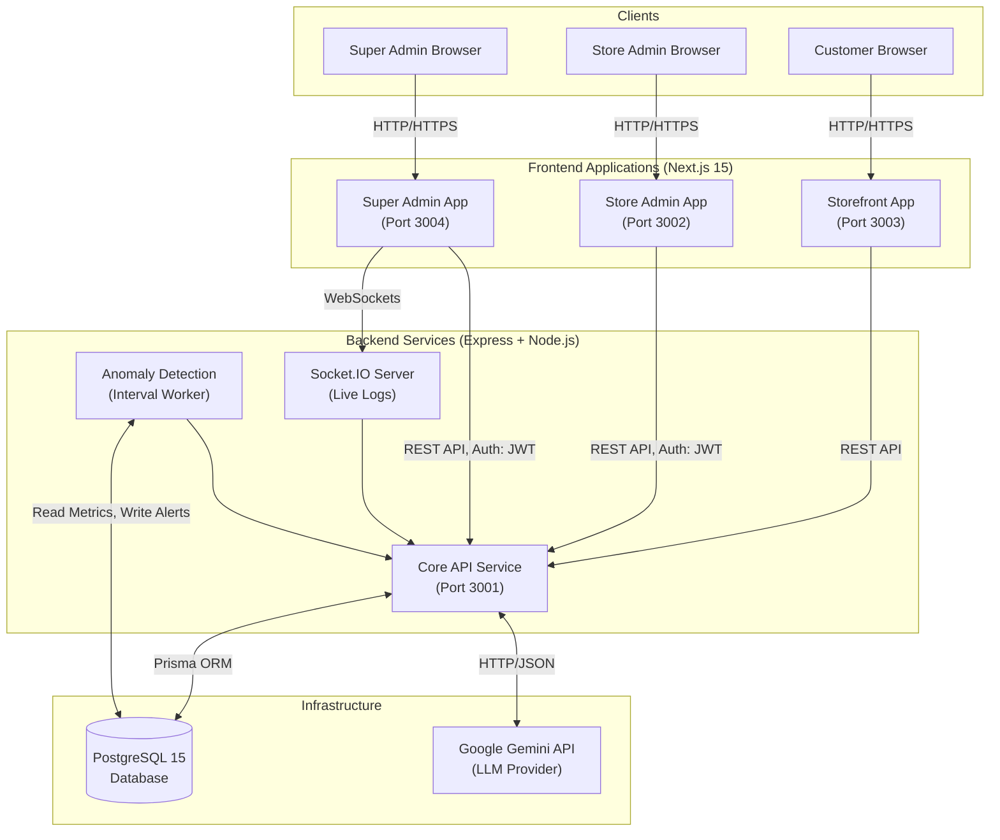
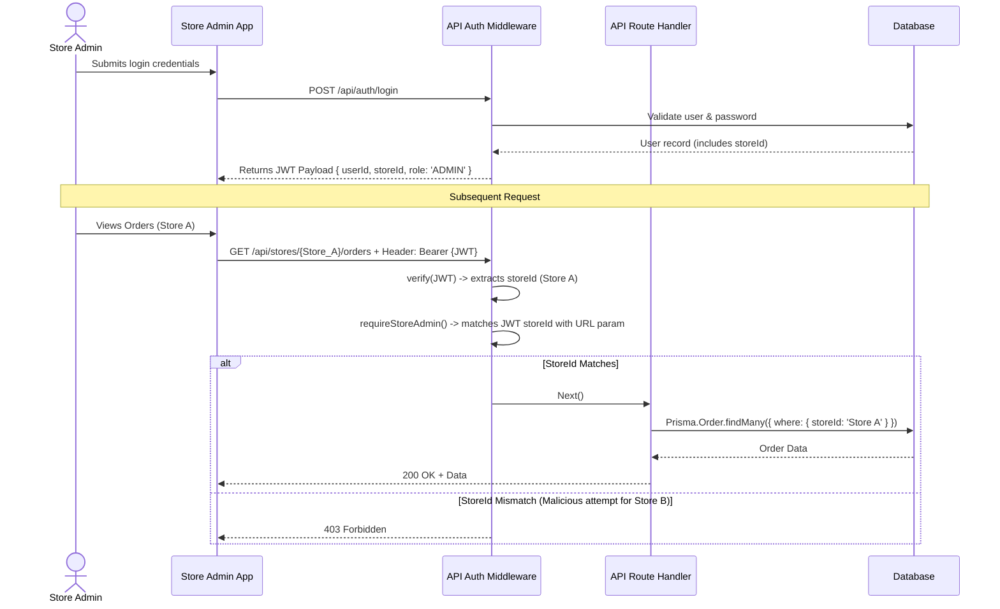
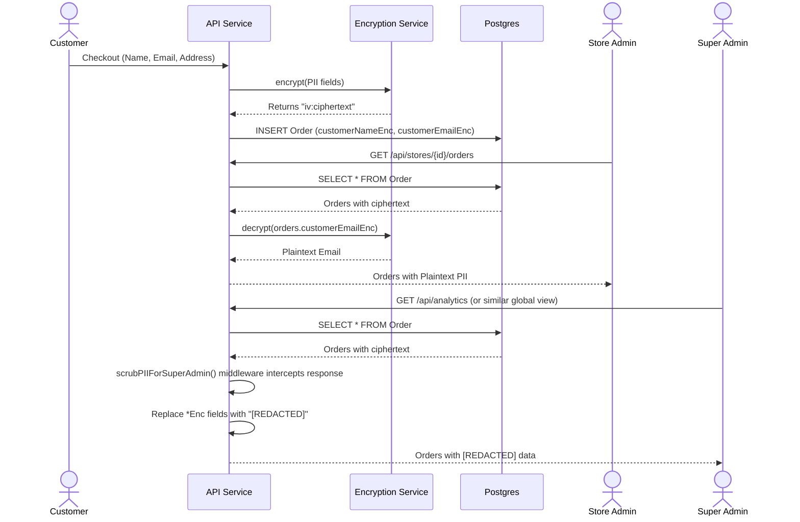
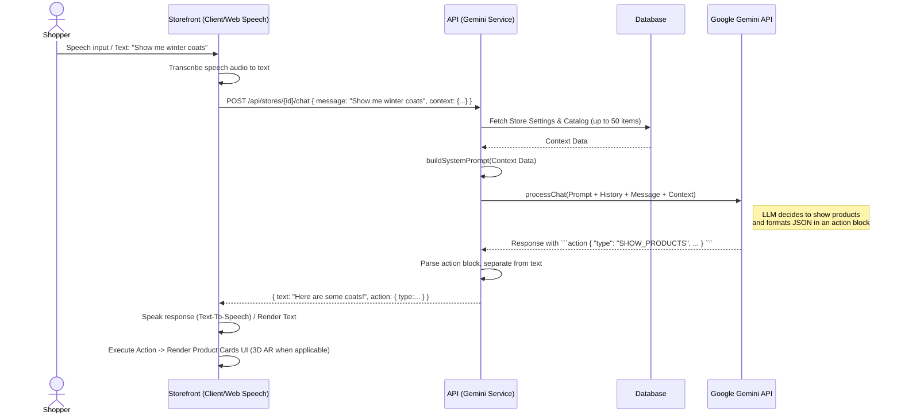
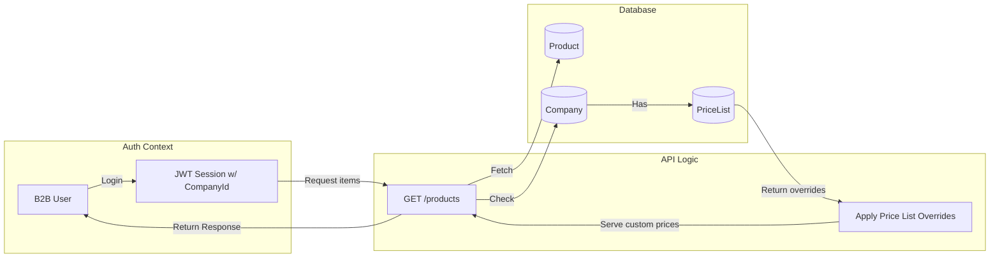

# Platform Architecture

This document provides an architectural overview of the `ecommerce-builder` platform. It is intended for software architects, technical leads, and system designers to understand the structural design, data flows, and key technical decisions made in this system.

---

## 1. System Topology

The platform follows a decoupled, service-oriented architecture centered around a stateless API backend and multiple purpose-built Next.js frontend applications.



### Components Summary
- **Storefront (`apps/store`)**: Public-facing app optimized for SEO and fast page loads. Serves dynamically built pages for individual tenants. Now supports Native AR & 3D product previews and Voice Commerce via Web Speech API.
- **Store Admin (`apps/admin`)**: Authenticated portal for store owners to manage products, orders, pages, and store settings. Includes management for A/B Testing, B2B wholesale features, and 3D asset generation.
- **Super Admin (`apps/super-admin`)**: Authenticated portal for platform operators. Handles cross-tenant support tickets, platform analytics, live logs, and anomaly alerts.
- **API (`services/api`)**: The unified backend component containing all business logic, data access, and integrations.

---

## 2. Core Architectural Patterns

### 2.1. Multi-Tenancy Model
The platform uses a **Logical Separation (Row-Level)** multi-tenancy model within a single unified PostgreSQL database.
- Every tenant-specific table contains a `storeId` foreign key.
- The authorization layer enforces isolation using JSON Web Tokens (JWT). A Store Admin's JWT contains their `storeId`.
- API middleware (`requireStoreAdmin`) intercepts requests and guarantees that `req.params.storeId` matches the token's `storeId`.

### 2.2. Statelessness and Scalability
- **Frontends**: Next.js applications are deployed in a stateless manner (or exported as static/SSR where applicable).
- **Backend**: The Express API holds no session state in memory. Session state is entirely encoded in the client-side JWTs. This allows the API to be horizontally scaled dynamically behind a load balancer without sticky sessions.
- **Cache**: Currently relies on DB performance; easily extensible to Redis for distributed caching if query load increases.

### 2.3. Defense in Depth (Data Security)
- **PII Encryption**: Customer Personally Identifiable Information (PII) is encrypted at the application layer before resting in the database.
- **Role-Based Attribute Scrubbing**: Super Admins possess broad platform access but are structurally blocked from viewing decrypted PII via a specialized response-interception middleware (`scrubPIIForSuperAdmin`).

---

## 3. Subsystem Workflows

### 3.1. Authentication and Multi-Tenancy Flow

The diagram below illustrates how a Store Admin accesses their specific store, ensuring they cannot read data from other tenants.



### 3.2. PII Encryption and Masking Flow

Encryption is handled symmetrically within the API layer. The database only ever sees ciphertext for PII fields (like addresses and emails).



### 3.3. Anomaly Detection Worker

The platform includes an internal background job that computes structural deviations in real-time metrics using Kullback-Leibler (KL) Divergence.

```mermaid
flowchart LR
    subgraph Background Worker
        Cron[setInterval Timer]
        Snapshotting[recordMetric()]
        Detection[runAnomalyChecks()]
        Math[detectAnomaly() -> KL Divergence]
    end

    subgraph Data Store
        MetricDB[(MetricSnapshot Table)]
        AlertDB[(Alert Table)]
    end

    subgraph Super Admin View
        Dashboard[Monitoring Dashboard]
    end

    Cron -->|Every 60s| Snapshotting
    Snapshotting -->|Insert Current Value| MetricDB
    Cron -->|Trigger Analysis| Detection
    Detection --> Math
    Math -->|Read 5m Window & 7d Baseline| MetricDB
    Math -->|If KL > Threshold| AlertDB
    
    AlertDB -->|Polling/Fetch| Dashboard
    MetricDB -->|Time Series Data| Dashboard
```

### 3.4. AI Chat Assistant Flow (Google Gemini & Voice Commerce)

The codebase deeply integrates LLMs to provide a conversational shopping assistant that can perform actions within the UI, including Voice Commerce support via Web Speech API.



### 3.5. Page Builder Architecture and A/B Testing

The platform provides a drag-and-drop page editor and supports A/B testing variants where traffic is split natively on the storefront. Data flows from a React visual editor down to a JSON schema.

```mermaid
flowchart TD
    subgraph Admin App (Editor)
        Palette[Component Palette]
        Canvas[Drop Canvas (dnd-kit)]
        Props[Property Panel]
        
        Palette -->|Drag & Drop| Canvas
        Canvas -->|Select Item| Props
        Props -->|Update Fields| Canvas
        Canvas -->|Serialize to JSON array| ReduxState[Editor State]
    end

    RestAPI[API Route: PUT /pages/:id / PUT /experiments/:id/variants]
    DB[(Postgres Page.layout / Variant.layout)]

    ReduxState -->|Save Layout/Variant| RestAPI
    RestAPI --> DB

    subgraph Storefront App (Renderer)
        Fetcher[Page Data Fetcher]
        ExperimentRouter[A/B Variant Router]
        Renderer[PageRenderer Component]
        DynamicComp[Dynamic Next.js Components\n(Hero, Grid, Button)]
        
        DB -->|Serve Page/Variants| Fetcher
        Fetcher --> ExperimentRouter
        ExperimentRouter -->|Roll traffic weights 50/50| Renderer
        Renderer -->|Instantiate passing props| DynamicComp
    end
```

### 3.6. B2B & Wholesale Flow

The architecture supports B2B wholesale pricing through `Company` entities linked to `PriceList` overrides.


