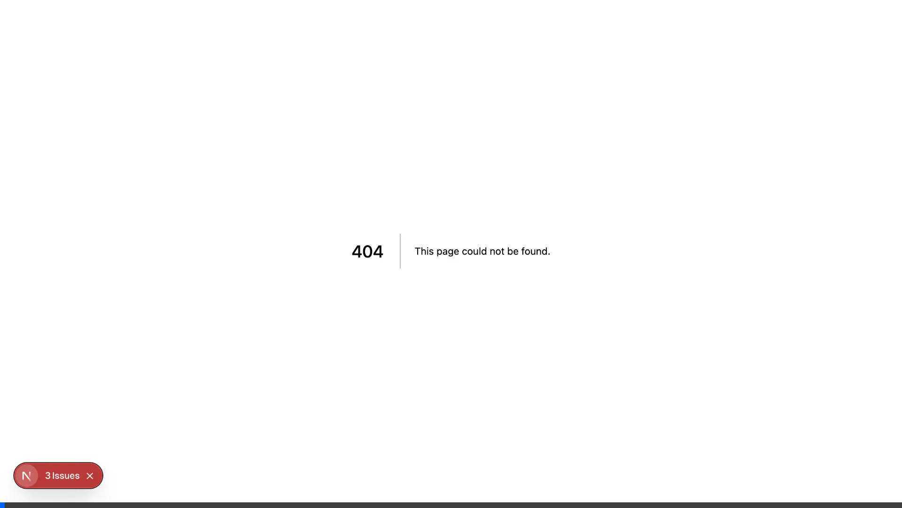
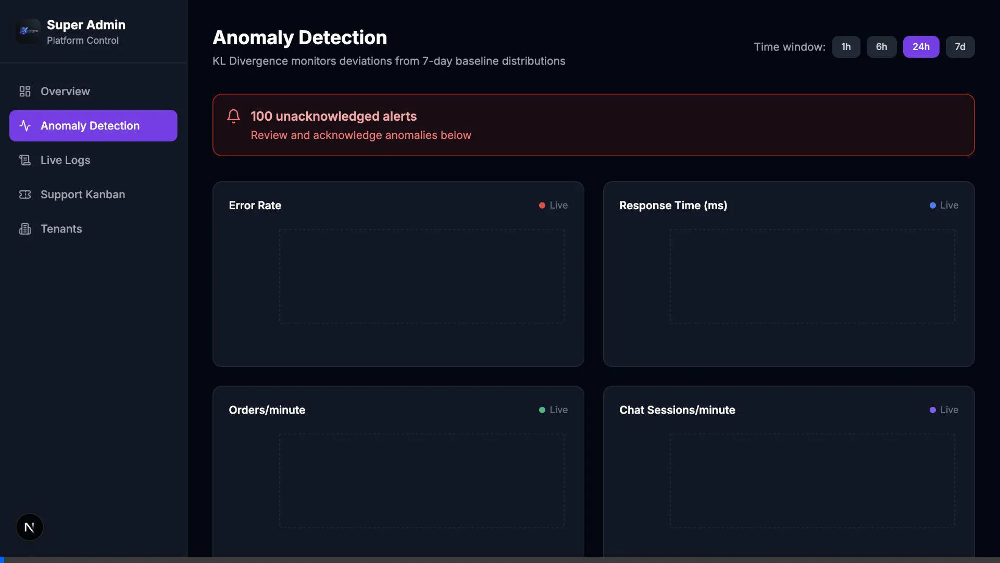
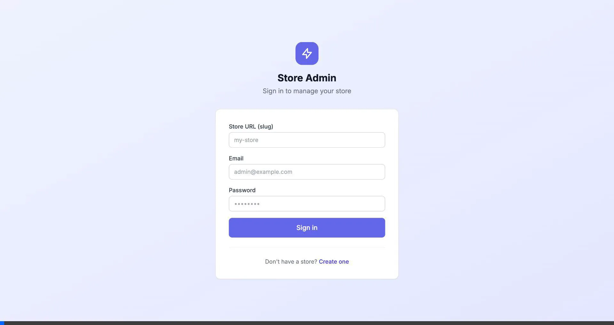
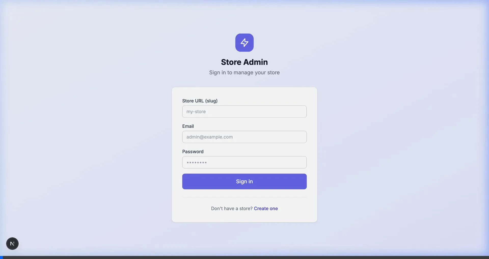
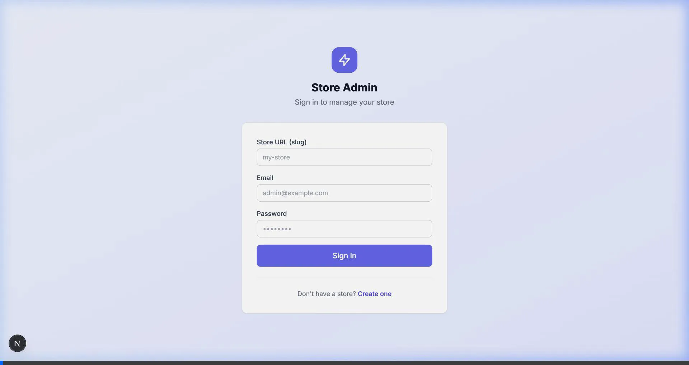
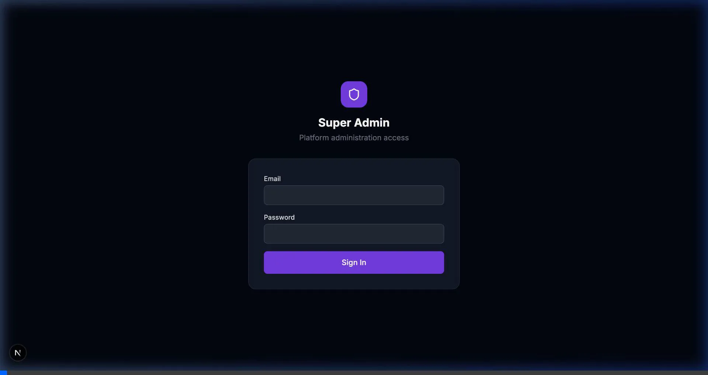
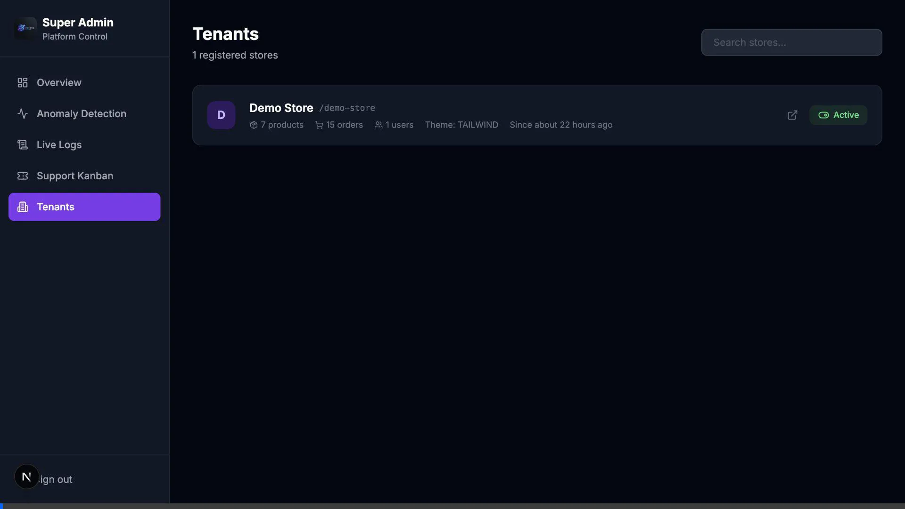

# Application Tutorials

This directory contains recordings of common user flows across the platform. These `.webp` files function as animated videos that demonstrate how to navigate and interact with various parts of the application.

## Storefront

### Product Details
A demonstration of navigating the storefront and viewing specific product details.

### Checkout Flow
A complete walkthrough of adding a product to the cart and completing the checkout process.

---

## Admin Dashboard

### Store Admin Login
Logging into a specific store's admin dashboard.

### Drag-and-Drop Page Builder
Interacting with the visual storefront layout builder.

### Inventory Management
Viewing the store's product inventory.

### Order Management
Viewing customer orders in the admin dashboard.

### A/B Testing
Viewing the experiments and A/B testing interface.

---

## Super Admin Operations

### Tenant Management
Logging in as a super admin and viewing the platform's active tenants (stores).

### Live Logs & Analytics
Viewing real-time platform logs and anomaly detection metrics.

